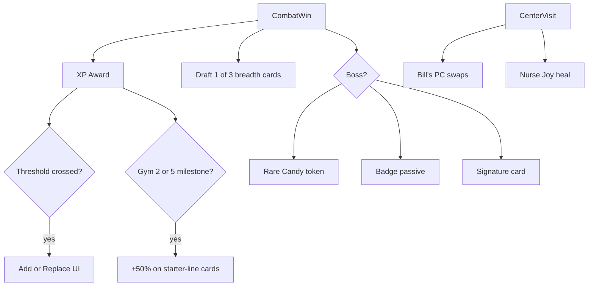

# Pokémon Crawlers — Gameplay Mechanics Roadmap

Portable copy of the implementation plan. **Workflow: one TODO at a time; manual review before marking complete.**

Last updated: 2026-07-10

---

## TODO Status

| ID | Status | Summary |
|----|--------|---------|
| `phase2a-encounter-model` | **DONE** | Mandatory vs optional encounters; `cleared_optional`; optional wilds → gold + draft |
| `phase2b-stage-layouts` | **DONE** | `stage_layouts.json` + `stage_layout.gd` for Route 1, Viridian Forest, Pewter |
| `phase2c-world-builder` | **DONE** | Maze stamping, shop buildings, interior backgrounds, encounter triggers |
| `phase2d-triggers-markers` | **DONE** | Optional/gate/boss ring-color markers; optional wilds skippable (facing only triggers gates) |
| `phase2e-minimap-sim` | **DONE** | Minimap fog-of-war + explored barriers; sim_check maze pathfinder w/ optional engagement rate |
| `phase1-learnset-data` | **DONE** | `learnsets.json` (move-set chains + XP), new learnset cards, XP constants (merged PR #5) |
| `phase1-learnset-code` | **DONE** | XP award + add/replace learns, learnset UI, HUD XP; trimmed `starters.json`, removed STAB injection, cleaned draft pools (merged PR #6) |
| `phase3-upgrades` | **DONE** | Rare Candy token (boss drop → evolve a deck card) + starter typed-card evolution damage milestones (committed `phase3-upgrades` branch) |
| `phase4-bills-pc` | **IMPLEMENTED — pending approval** | Bill's PC at Centers after first badge: deposit/withdraw cards, 3 swaps/visit, 5g/swap, min deck 5 |
| `phase5a-gym-engine` | **IMPLEMENTED — pending approval** | Data-driven N-gym run loop: uniform `segments[]`; every leader grants badge+signature+rare candy and **continues**, only the `is_final` leader ends the run; sim + validation scale to N. (world_builder zone/gym de-hardcoding deferred to `phase5-map-format`) |
| `phase5-map-format` | **IMPLEMENTED — pending approval** | ASCII-grid-in-JSON layouts + parser; migrated the 3 stages; optional-wild count/placement now from the grid (`w` cells); zone names + gym anchors data-driven; reachability validation |
| `phase5-map-editor` | **Planned** | In-engine paint tool (`--mapeditor`) over the grid format: terrain + encounter palettes, click-to-paint, load/save JSON, live spawn→gate reachability validation |
| `phase5b-gym-mechanics` | Pending | New combat mechanics (stamina drain, multi-status/action, stacking poison+evasion, hand shuffle, arena lava tick, multi-phase boss, escalating Center costs) + badge-passive schema |
| `phase5c-gym-content` | Pending | Author 8 gyms + E4 with the editor: Pokémon, leaders, badges, signature cards, draft pools, maze layouts; balance pass |
| `phase6-telemetry` | Pending | Run log metrics + sim_check extensions |

**Current next TODO:** `phase5-map-editor` (5a + map-format implemented, awaiting sign-off). Editor lands before `phase5c` content authoring.

---

## Delivery Workflow

1. Implement **exactly one TODO** per session.
2. Stop for manual review (what changed, how to test, known gaps).
3. Do **not** start the next TODO until explicitly approved.
4. On approval: mark complete, then wait for "go" on the next item.

---

## Implementation Priority

| Order | Phase | Why |
|-------|-------|-----|
| 1 | Phase 2 — Maze maps (2a→2e) | Biggest feel change; no XP dependency |
| 2 | Phase 1 — XP learnset | Deck identity on top of opt-in wilds |
| 3 | Phase 3 — Rare Candy + starter evolution | Needs XP milestones |
| 4 | Phase 4 — Bill's PC | Needs cards + Centers |
| 5–6 | Phases 5–6 — Content + telemetry | Scale to 8 gyms; balance harness |

**Phase 2 interim behavior** (until Phase 1):
- Optional wilds: gold + draft, once per tile (`cleared_optional`)
- Mandatory gates advance `encounter_index` only
- 6-card starter decks + STAB draft injection stay until Phase 1

---

## Phase 2c — Completed Work (pending sign-off)

### World / layout
- `godot/data/balance/stage_layouts.json` — hub layouts (spawn, gate, optional spawns, funnel, shops, Pewter gym)
- `godot/scripts/world/stage_layout.gd` — loader/helpers
- `godot/scripts/world/world_builder.gd` — `WorldMapBuilder` stamps stages from JSON
- `godot/scripts/world/world_grid.gd` — `OPTIONAL_ENCOUNTER`, `GATE_ENCOUNTER` tile kinds
- `godot/scripts/ui/minimap.gd` — 10×6 window, shop/gate colors
- `godot/scripts/core/balance_db.gd` — loads/validates layouts

### Encounter / combat fixes (bundled)
- `run_manager.gd` — mandatory vs optional split; `cleared_optional`
- Trigger on encounter tile **or** adjacent when facing; snap combat camera toward enemy
- `effects.gd` — `attack_type_for_action()` fixes rival Quick Attack type (NORMAL from cards.json)

### Shop flow
- `main.gd` — hide 3D world + minimap on shop entry; warp facing **away** from building on leave
- `shop_ui.gd` — interior JPEG as full-screen background behind semi-opaque shop panel
- `godot/art/ui/pokemon_center_splash.jpg`, `pokemart_splash.jpg` (+ `.import`; `!art/ui/*.import` in `.gitignore`)

### Procedural shop buildings (`world_builder.gd`)
- Larger footprint; double door; one window + text sign (mirrored Center vs Mart)
- Colored fascia band + Pokéball emblem; rounded roof lip
- `_add_quad()` for textured facade decals (fixes BoxMesh UV cropping)
- Welcome mat aligned to shop tile; no `_block_shop_shell()` random walls
- Props skip shop tiles and neighbors (no boulders behind shops)

### Manual test checklist (Phase 2c)
- [ ] Walk Route 1 → Forest → Pewter; optional wilds skippable; gates block until cleared
- [ ] Enter/leave Center and Mart; interior background visible; leave facing corridor
- [ ] Shop buildings: door/window/sign readable; mat centered; no stray walls/boulders
- [ ] Minimap shows layout; simcheck passes: `godot --headless . -- --simcheck`

---

## Phase 2 — Complete

### 2d — Triggers & markers (DONE)
- `encounter_marker.gd` — `MarkerKind {OPTIONAL, GATE, BOSS}` distinguished by ring
  color alone: optional = cool-blue dim ring, gate = warm-gold ring, boss = fiery ring.
  No arch/banner structures — a mandatory fight already reads as such from its blocked
  chokepoint (bosses are further dressed by gym lighting/door).
- `world_builder.gd` — `_build_markers` passes kind; `_try_trigger_encounter` now only
  starts *gate* fights when facing an adjacent tile (their tile is blocked). Optional
  wilds trigger solely by stepping onto their tile, so they are truly skippable — this
  also covers the turn-in-place case, since `player_controller._start_turn` emits
  `tile_entered`.

### 2e — Minimap & sim (DONE)
- `minimap.gd` — fog of war: only discovered tiles draw; walking a tile reveals its 8
  neighbors so flanking **walls/barriers** show as solid slabs. Walked tiles draw at
  full color, seen-but-not-walked tiles are dimmed, unexplored stays dark.
- `world_builder.gd` — `build_grid_only()` produces the maze grid with no 3D geometry
  for headless use.
- `sim_check.gd` — maze pathfinder: BFS-walks the real stage grid, greedy toward each
  gate, engaging reachable optional wilds at a configurable rate (`--engage=`, default
  0.6). Reports optionals engaged + maze steps alongside win rate.

---

## Phase 1 — XP Learnset

**Goal:** Fix early-game deck identity. Ships after Phase 2.

### Data — `phase1-learnset-data` (IMPLEMENTED — pending approval)
| File | Change | Status |
|------|--------|--------|
| `learnsets.json` | Per-starter `starter_deck` (3-card Normal filler) + `lines[]`; each line is a move chain with `stages[]` of `{xp, card_id}`. First stage adds; later stages replace (Vine Whip→Razor Leaf→Leaf Storm). **Paced for the full 8-gym + E4 arc** on unlock ladder `[30,100,190,280,370,460,550,640,700]`: full move set by ~gym 8 (min path) / ~gym 6 (all optional wilds), ~1–2 unlocks per gym. **Gym-1 grind reward:** Brock is preceded by 2 mid-bosses (60 XP) + ~10 wilds; move #1 (30) is guaranteed pre-Brock, move #2 (100) needs ~4 wilds — a grind reward unreachable on the skip path, with rung3 (190) above the ~160 grind ceiling. Provisional. | ✅ new file |
| `cards.json` | Added 26 learnset moves: `leech_seed`, `giga_drain`, `razor_leaf`, `leaf_storm`, `take_down`, `double_edge`, `solar_beam`, `petal_dance`, `skull_bash`, `water_pulse`, `hydro_pump`, `bubble`, `bubble_beam`, `withdraw`, `protect`, `steel_defense`, `rain_dance`, `slash`, `dragon_claw`, `flame_burst`, `flamethrower`, `fire_spin`, `smoke_screen`, `scary_face`, `rage`, `dragon_rage` — all using existing effect vocabulary (recoil = self-targeted `ignore_block` damage; burn/leech = `poison` DoT + `heal`). | ✅ |
| `constants.json` | XP economy `xp.per_wild` 10 / `xp.per_mid_boss` 30 / `xp.per_gym_boss` 90 (≈3:1 mandatory:optional per gym); assumes Phase 5 builds 8 gym segments to match | ✅ |
| `balance_db.gd` | Load + validate `learnsets` (cards exist, XP non-decreasing per line); validate all `evolves_to` targets; XP + `learnset_for()` accessors | ✅ |
| `starters.json` | Trim to filler decks | ⏭ deferred to `phase1-learnset-code` (coupled to deck build) |
| `stage_rewards.json` | Remove starter-line moves from draft pools | ⏭ deferred (coupled to STAB removal) |

### Code — `phase1-learnset-code` (IMPLEMENTED — pending approval)
| File | Change | Status |
|------|--------|--------|
| `player_state.gd` | `xp` + per-line `learn_progress` / `learn_current` | ✅ |
| `learnset_ops.gd` | `init_run()`, `award_xp()`, add/replace learn events, `next_unlock()` | ✅ new |
| `learnset_ui.gd` | "Learned a move" add/replace overlay | ✅ new |
| `run_manager.gd` | Deck via `LearnsetOps.init_run`; award XP in `after_win()`; return `learn_events`; dropped fixed evolution catalyst | ✅ |
| `main.gd` | Chain combat → learnset → draft; XP toast | ✅ |
| `rewards.gd` | Removed STAB injection | ✅ |
| `game_hud.gd` | XP + next-unlock line | ✅ |
| `starters.json` / `starter_ui.gd` / `stage_rewards.json` | Trim to filler; UI shows learnset deck; drop `bite` from pools | ✅ |

**PoC balance note:** thresholds are paced for the full 8-gym arc, so the 1-gym PoC only surfaces the first 1–2 unlocks; grinding costs HP with little short-run payoff there (sim: engage 0.0→51%, 0.5→34%, 1.0→36%). The XP→power loop is wired; PoC balance still favors rushing until later gyms exist (Phase 5).

---

## Phase 3 — Rare Candy + Starter Evolution (IMPLEMENTED — pending approval)

- **Rare Candy:** boss reward; pick any active-deck card with `evolves_to`; `rare_candy_ui.gd`
- **Starter typed evolution:** +50% damage on starter-line cards at XP milestones after Gym 2 and Gym 5 (multiplicative per tier default)

### Data
| File | Change | Status |
|------|--------|--------|
| `constants.json` | `rewards.rare_candy_mid_boss`/`rare_candy_gym_boss` (1 each); `starter_evolution.tiers` = `[{at_xp:190, mult:1.5}, {at_xp:460, mult:1.5}]` (provisional, ~Gym 2 / ~Gym 5, unreachable in 1-gym PoC) | ✅ |
| `balance_db.gd` | `starter_line_cards()`, `starter_evolution_tiers()`, `rare_candy_*()` accessors; validate tiers non-decreasing / positive mult | ✅ |

### Code
| File | Change | Status |
|------|--------|--------|
| `player_state.gd` | `starter_id` + `rare_candy` fields | ✅ |
| `starter_evo.gd` | `tier()`, `damage_mult()`, `card_damage_mult()` — starter-line buff from XP milestones | ✅ new |
| `effects.gd` | thread `outgoing_mult` through `resolve_card_effects` → `resolve_effects` → `apply_damage`; multiplied alongside `badge_mult` (starter-line cards only) | ✅ |
| `rare_candy_ops.gd` | `evolvable_deck_cards()` (deck cards with valid `evolves_to`, **excluding** learnset-managed cards so tokens can't desync XP progression), `has_spendable()`, `spend()` | ✅ new |
| `rare_candy_ui.gd` | tappable from→to evolve picker + "Save it for later" | ✅ new |
| `rewards.gd` / `run_manager.gd` | grant tokens (gym boss via `grant_boss_rewards`; mid-bosses in `after_win` so the loop is exercisable pre-Brock); set `player.starter_id`; `after_win` returns `rare_candy_gained` | ✅ |
| `main.gd` | post-win chain now combat → learnset → **Rare Candy** → draft; "Found/Evolved" toasts | ✅ |
| `game_hud.gd` | Rare Candy count + starter-evo tier lines | ✅ |

**PoC note:** starter-evolution tiers (190/460 XP) don't fire in the 1-gym PoC (grind ceiling ~160 XP), same posture as Phase 1 — the buff is wired and applies in combat via `resolve_card_effects`, but tier stays 0 (mult 1.0). Rare Candy **is** exercisable: mid-bosses (rival, bug catchers) drop a token spendable on `quick_attack`→`hyper_fang` / poison-powder lines. Sim: 300 runs, 33.7% win, 4.6 optionals, 48.1 steps — no combat regression.

### Manual test checklist (Phase 3)
- [ ] Beat a mid-boss (rival / bug catcher) → "Found a Rare Candy!" toast; HUD shows `Rare Candy ×1`
- [ ] After a subsequent win, Rare Candy overlay lists only evolvable **non-starter-line** deck cards (e.g. Quick Attack → Hyper Fang); starter moves absent
- [ ] Pick a card → every copy evolves, token decrements, "Evolved into …" toast; deck size unchanged
- [ ] "Save it for later" keeps the token; it re-offers after the next win
- [ ] `godot --headless --import .` then `--simcheck` passes (needed once so new `class_name`s register)

> **Note:** new `class_name` scripts (`StarterEvo`, `RareCandyOps`, `RareCandyUI`) must be registered via an `--import` pass before a headless `--simcheck`, else `effects.gd` fails to resolve `StarterEvo` and combat errors out. The editor registers them automatically on open.

---

## Phase 4 — Bill's PC (IMPLEMENTED — pending approval)

After the first badge. `pc_ops.gd`, `bills_pc_ui.gd`, button in `shop_ui.gd` at Centers.
`swap_limit: 3`, `swap_fee: 5`, `min_deck_size: 5`. Resets swaps on Center visit.

### Data
| File | Change | Status |
|------|--------|--------|
| `items.json` | `economy.bills_pc` = `{swap_limit:3, swap_fee:5, min_deck_size:5}` | ✅ |
| `balance_db.gd` | load `bills_pc` into `economy`; `bills_pc()` accessor | ✅ |

### Code
| File | Change | Status |
|------|--------|--------|
| `player_state.gd` | `pc_box: Array[String]` + `pc_swaps_used: int` (fresh per run) | ✅ |
| `pc_ops.gd` | `unlocked()` (needs a badge), `on_center_visit()` (reset swaps), `deposit()`/`withdraw()` (fee + per-visit limit + min-deck floor), `active_deck_cards/size` (consolidates deck+hand+discard), `swaps_remaining()` | ✅ new |
| `bills_pc_ui.gd` | two-column deck⇄box swap overlay (layer 12) with per-card deposit/withdraw, live swap/fee/gold status, disabled states | ✅ new |
| `shop_ui.gd` | badge-gated "Bill's PC" button in the Center panel; `on_center_visit()` swap reset on Center entry | ✅ |

**Design:** a "swap" = one deposit **or** one withdraw; each costs the flat fee and burns one of the 3 per-visit swaps. Deposits can't drop the active deck below `min_deck_size` (keeps it ≥ hand size). Box persists across the run; swap budget refreshes every Center entry.

**PoC note:** strict badge-gated per the locked decision, so Bill's PC is **unreachable in the 1-gym PoC** (the only badge comes from Brock, who ends the run) — dead content until Phase 5 adds post-Gym-1 Centers, same posture as the starter-evo milestones. Ops verified headless (24 assertions: swap limit, fee, min-deck floor, reset, unlock, discard-pile deposits); UI cannot be driven pre-badge.

### Manual test checklist (Phase 4) — needs Phase 5 (a Center after a badge)
- [ ] "Bill's PC" button hidden at pre-badge Centers, shown after the first badge
- [ ] Deposit moves a card deck→box, charges 5g, decrements the swap counter
- [ ] Withdraw moves box→deck, charges 5g, shares the same 3-swap budget
- [ ] Deposit blocked at min deck size (5) and when gold < fee or swaps exhausted
- [ ] Leaving and re-entering a Center refreshes the swap budget to 3

---

## Phase 5 — 8 Gyms + Victory Road

Milestone-sized; split into 5a/5b/5c so each fits the one-TODO cadence.

### 5a — Multi-gym run engine (IMPLEMENTED — pending approval)
Generalized the hardcoded 3-stage-+-`pewter_encounter_sequence` build into a uniform
`segments[]` in `run_config.json`. Each segment: `{id, wild_pool/wilds, wild_count,
leader | leader_variants, leader_kind, leader_gold, badge_id?, signature_card?,
reward_pool_key, shop_window, is_final}`.

| File | Change |
|------|--------|
| `run_config.json` | `segments[]` replaces `stages` + `pewter_encounter_sequence`; dropped legacy `evolution*` / top-level `badge_id`/`signature_card` (now per-segment) |
| `run_manager.gd` | `_build_encounters` = one loop over segments (`_segment_wilds`, `_resolve_leader_id`, `_make_leader_gate`); `after_win` grants leader rewards via `Rewards.grant_leader_rewards`, only `is_final` ends the run; removed `evolution_applied` |
| `rewards.gd` | `grant_leader_rewards(player, enc, bal)` — badge (dedup) + signature + rare candy (gym vs mid-boss by `leader_kind`); removed `grant_boss_rewards` + dead `apply_evolution_catalyst` |
| `balance_db.gd` | `_validate_segments` (enemies/pools/badges/signature exist; exactly one `is_final`); dropped evolution/pewter checks |
| `stage_layout.gd` | `stage_ids_in_order` + `validate` iterate segments; `_segment_optional_count` |
| `learnset_ops.gd` | gym XP keyed on `leader_kind == "gym"` (not `is_final_boss`) |

**Not touched (deferred to `phase5-map-format`):** `world_builder` still stamps the 3
existing layouts by coordinates and keys gym visuals off `is_final_boss` / `stage_id ==
"pewter"`. Encounter *placement* moves into the grid there, not here.

**Verified:** simcheck 300 runs ~40% (no regression; same loss profile rival→bug
catcher→onix/brock); balance validation passes at load; headless leader-reward test
(12 assertions: gym vs trainer rewards, badge dedup, one-final-gate, gates==segments).

### 5b — New combat mechanics + badge passives
Add only the mechanics not already in the effect vocabulary, extend `badges.json` schema
beyond `outgoing_damage_mult`.

| Gym | Mechanic | New? |
|-----|----------|------|
| Brock | Block cycling | mostly data |
| Misty | Heal + ignore-block | exists (heal, ignore_block) |
| Surge | Paralyze + stamina drain | paralyze exists; **stamina drain new** |
| Erika | Multi-status per action | **new** (multiple statuses/action) |
| Koga | Stacking poison + evasion | poison exists; **evasion/stacking new** |
| Sabrina | Hand shuffle | **new** |
| Blaine | Arena lava tick | **new** (per-turn arena DoT) |
| Giovanni | Multi-phase boss | **new** (phase transitions) |
| E4 | Boss rush, escalating Center costs | **new** (Center cost scaling) |

### 5c — Full content
Author all 8 gyms + E4: Pokémon (enemies.json + sprites), leaders, badges, signature
cards, draft pools, maze layouts. Balance pass via `sim_check` (+ Phase 6 telemetry).

### Map-authoring tooling (DECIDED — ASCII-grid now → creator tool later)
Walls today are **100% hand-authored** `blocked_cells` coordinate arrays (no procedural
generation; `template` is decor only). Chosen path: an ASCII grid format hand-authored
now, with a paint tool built later that reads/writes the **same** format.

**Format** (`phase5-map-format` — IMPLEMENTED): geometry lives in `stage_layouts.json` as a
`grid` array of equal-length strings (replacing `blocked_cells`/coordinate lists); stays
valid JSON and diff-friendly. Legend (as shipped):
- Terrain (walkable): `.` grass · `=` road · `,` dirt · `_` interior/gym floor
- Terrain (barrier): `#` wall · `T` tree · `H` hedge · `^` mountain · `B` building
- Objects (walkable cells): `S` spawn · `X` exit · `c` center · `m` mart · `w` wild ·
  `L` leader gate · `D` gym door

| File | Change |
|------|--------|
| `stage_layouts.json` | 3 stages migrated to `grid` + metadata (`template`, `display_name`, `gym_name`, `gate_facing`, `funnel_cells`, `shop_windows`); coordinate lists removed |
| `stage_layout.gd` | grid parser (cached) → derives size/walkable/blocked/spawn/exit/shops/optionals/leader/gym; leader trigger + north facing derived; `optional_count`, `display_name`, `gym_display_name`; grid validation incl. spawn→leader + optional reachability (BFS) |
| `run_manager.gd` | optional-wild count from `StageLayout.optional_count` (one per `w`); species from `wild_pool`; dropped `wild_count`/`wilds` |
| `run_config.json` | segments keep `wild_pool` only (count/placement now in the grid) |
| `world_builder.gd` | `zone_name_for_cell` reads `display_name`/`gym_name`; gym floor/door stamping de-hardcoded from `stage_id == "pewter"` (driven by grid `_`/`D`) |

**Verified:** grids generated from the old coordinates (temp `--gridgen`, then removed) so
geometry is faithful; simcheck ~34–37% with healthy maze traversal (4.6 optionals, ~48
steps), reachability validation passes at load, no errors.

**Balance side-effect (defer to 5c):** Pewter's pre-Brock wilds are now drawn randomly from
`["geodude","zubat","onix"]` (per `w` cell) instead of the old fixed `[geodude,zubat,onix,
geodude]`. Onix can now appear 0–4× per run instead of exactly once, so difficulty variance
(and onix losses) rose — win rate dipped ~40%→~35%. The map/pool mechanic is correct; tune
the Pewter pool (or make Onix a weighted/rare wild) during content balancing.

**Deferred to the editor / later:** the optional cosmetic terrain layer (per-cell grass vs
road, tree vs wall visuals) — the renderer still collapses barrier→wall and walkable→floor.

**Decisions (locked):**
- **Map owns encounter placement + type.** The grid declares where each encounter is and
  its type (wild/trainer/rival/leader); the segment supplies the species *pool* per type.
  `_build_encounters` reads counts/placement from the grid, not a `wild_count`.
- **Single logical layer now.** Hand-authoring uses one grid (walkability + objects). A
  cosmetic per-cell terrain layer (grass vs road, tree vs wall visuals) is optional and
  added later by the tool; the renderer collapses subtypes to default floor/wall until
  per-cell terrain rendering exists.

**Editor** (`phase5-map-editor`): in-engine standalone scene (`--mapeditor`) reusing the
`world_grid`/tile rendering — grid canvas, terrain + encounter palette sidebar,
click-to-paint, load/save the JSON `grid`, live spawn→gate reachability validation.

---

## Phase 6 — Telemetry

`run_log.gd`: xp, learned_moves, deck_size_per_stage, storage metrics, badges_at_loss, gym_reached, rare_candy_uses, starter_evolution_tier. Wire into `sim_check.gd`.

---

## Target Architecture



### Maze mental model

- **Open area** — walkable region with loops and optional wilds
- **Funnel gate** — mandatory fight at chokepoint; blocks progression until cleared
- **Stage transition** — gate exit → next region; shops in town pockets

---

## Key Files

| Area | Files |
|------|-------|
| Map / wilds | `stage_layouts.json`, `stage_layout.gd`, `world_builder.gd`, `world_grid.gd`, `run_manager.gd`, `minimap.gd` |
| Shops | `shop_ui.gd`, `main.gd`, `art/ui/*_splash.jpg` |
| XP / Learnset | `learnsets.json`, `learnset_ops.gd`, `learnset_ui.gd`, `player_state.gd` |
| Rare Candy / starter evo | `rare_candy_ui.gd`, `rare_candy_ops.gd`, `starter_evo.gd`, `deck_ops.gd`, `effects.gd`, `constants.json` |
| Bill's PC | `bills_pc_ui.gd`, `pc_ops.gd`, `shop_ui.gd` |
| 8 Gyms | `run_config.json`, `enemies.json`, `badges.json`, `cards.json`, `effects.gd` |
| Harness | `sim_check.gd`, `run_log.gd` |

---

## Decisions (locked)

| Topic | Decision |
|-------|----------|
| Starter decks | 3-card Normal filler; typed moves from learnset |
| Evolution | Rare Candy from bosses; starter +50% dmg at Gym 2/5 XP milestones |
| Bill's PC | After Gym 1; 3 swaps, 5g fee, min deck 5 |
| Optional wilds | Gold + draft; once per tile (`cleared_optional`) |
| World | Branching maze per stage; mandatory fights at funnel gates only |
| Workflow | One TODO per review cycle |

---

## Godot commands

```powershell
cd godot
# Balance sim
& "$env:LOCALAPPDATA\Microsoft\WinGet\Packages\GodotEngine.GodotEngine_Microsoft.Winget.Source_8wekyb3d8bbwe\Godot_v4.7-stable_win64.exe" --headless . -- --simcheck

# Re-import assets after adding art
& "$env:LOCALAPPDATA\Microsoft\WinGet\Packages\GodotEngine.GodotEngine_Microsoft.Winget.Source_8wekyb3d8bbwe\Godot_v4.7-stable_win64.exe" --headless --import .
```

---

## Related docs

- [`docs/GODOT_HANDOFF.md`](GODOT_HANDOFF.md) — project handoff
- [`docs/POC_BALANCE_TUNING.md`](POC_BALANCE_TUNING.md) — balance notes
- Cursor plan (IDE): `.cursor/plans/gameplay_mechanics_roadmap_eb2443a9.plan.md`
