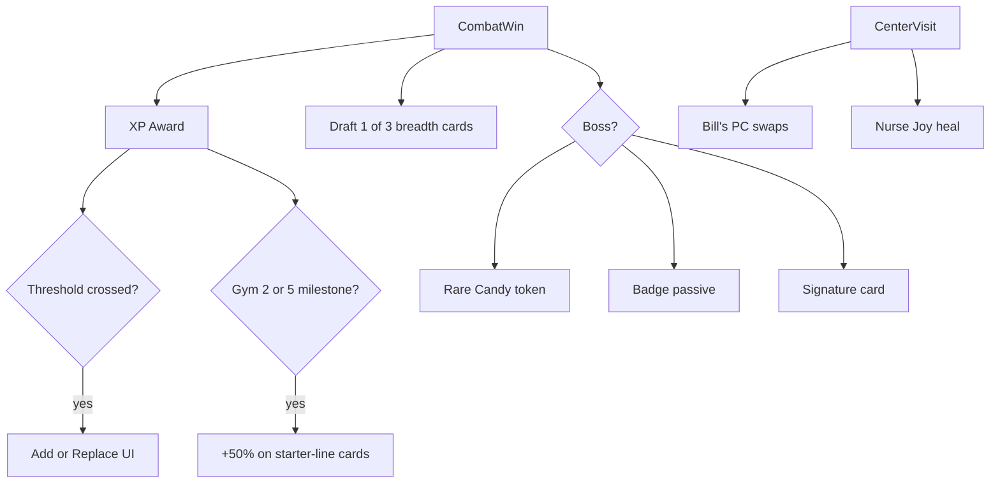

# Pokémon Crawlers — Gameplay Mechanics Roadmap

Portable copy of the implementation plan. **Workflow: one TODO at a time; manual review before marking complete.**

Last updated: 2026-07-09

---

## TODO Status

| ID | Status | Summary |
|----|--------|---------|
| `phase2a-encounter-model` | **DONE** | Mandatory vs optional encounters; `cleared_optional`; optional wilds → gold + draft |
| `phase2b-stage-layouts` | **DONE** | `stage_layouts.json` + `stage_layout.gd` for Route 1, Viridian Forest, Pewter |
| `phase2c-world-builder` | **DONE** | Maze stamping, shop buildings, interior backgrounds, encounter triggers |
| `phase2d-triggers-markers` | **DONE** | Optional/gate/boss ring-color markers; optional wilds skippable (facing only triggers gates) |
| `phase2e-minimap-sim` | **DONE** | Minimap fog-of-war + explored barriers; sim_check maze pathfinder w/ optional engagement rate |
| `phase1-learnset-data` | **IMPLEMENTED — pending approval** | `learnsets.json` (move-set chains + XP), new learnset cards, XP constants (starter trim + draft cleanup deferred to code TODO) |
| `phase1-learnset-code` | **IMPLEMENTED — pending approval** | XP award + add/replace learns, learnset UI, HUD XP; trimmed `starters.json`, removed STAB injection, cleaned draft pools |
| `phase3-upgrades` | Pending | Rare Candy + starter typed-card evolution milestones |
| `phase4-bills-pc` | Pending | Bill's PC in Pokémon Center after Gym 1 |
| `phase5-gyms-content` | Pending | 8 gyms + E4 content and mechanics |
| `phase6-telemetry` | Pending | Run log metrics + sim_check extensions |

**Current next TODO:** `phase3-upgrades` (Phase 1 implemented; awaiting sign-off)

---

## Delivery Workflow

1. Implement **exactly one TODO** per session.
2. Stop for manual review (what changed, how to test, known gaps).
3. Do **not** start the next TODO until explicitly approved.
4. On approval: mark complete, then wait for "go" on the next item.

---

## Implementation Priority

| Order | Phase | Why |
|-------|-------|-----|
| 1 | Phase 2 — Maze maps (2a→2e) | Biggest feel change; no XP dependency |
| 2 | Phase 1 — XP learnset | Deck identity on top of opt-in wilds |
| 3 | Phase 3 — Rare Candy + starter evolution | Needs XP milestones |
| 4 | Phase 4 — Bill's PC | Needs cards + Centers |
| 5–6 | Phases 5–6 — Content + telemetry | Scale to 8 gyms; balance harness |

**Phase 2 interim behavior** (until Phase 1):
- Optional wilds: gold + draft, once per tile (`cleared_optional`)
- Mandatory gates advance `encounter_index` only
- 6-card starter decks + STAB draft injection stay until Phase 1

---

## Phase 2c — Completed Work (pending sign-off)

### World / layout
- `godot/data/balance/stage_layouts.json` — hub layouts (spawn, gate, optional spawns, funnel, shops, Pewter gym)
- `godot/scripts/world/stage_layout.gd` — loader/helpers
- `godot/scripts/world/world_builder.gd` — `WorldMapBuilder` stamps stages from JSON
- `godot/scripts/world/world_grid.gd` — `OPTIONAL_ENCOUNTER`, `GATE_ENCOUNTER` tile kinds
- `godot/scripts/ui/minimap.gd` — 10×6 window, shop/gate colors
- `godot/scripts/core/balance_db.gd` — loads/validates layouts

### Encounter / combat fixes (bundled)
- `run_manager.gd` — mandatory vs optional split; `cleared_optional`
- Trigger on encounter tile **or** adjacent when facing; snap combat camera toward enemy
- `effects.gd` — `attack_type_for_action()` fixes rival Quick Attack type (NORMAL from cards.json)

### Shop flow
- `main.gd` — hide 3D world + minimap on shop entry; warp facing **away** from building on leave
- `shop_ui.gd` — interior JPEG as full-screen background behind semi-opaque shop panel
- `godot/art/ui/pokemon_center_splash.jpg`, `pokemart_splash.jpg` (+ `.import`; `!art/ui/*.import` in `.gitignore`)

### Procedural shop buildings (`world_builder.gd`)
- Larger footprint; double door; one window + text sign (mirrored Center vs Mart)
- Colored fascia band + Pokéball emblem; rounded roof lip
- `_add_quad()` for textured facade decals (fixes BoxMesh UV cropping)
- Welcome mat aligned to shop tile; no `_block_shop_shell()` random walls
- Props skip shop tiles and neighbors (no boulders behind shops)

### Manual test checklist (Phase 2c)
- [ ] Walk Route 1 → Forest → Pewter; optional wilds skippable; gates block until cleared
- [ ] Enter/leave Center and Mart; interior background visible; leave facing corridor
- [ ] Shop buildings: door/window/sign readable; mat centered; no stray walls/boulders
- [ ] Minimap shows layout; simcheck passes: `godot --headless . -- --simcheck`

---

## Phase 2 — Complete

### 2d — Triggers & markers (DONE)
- `encounter_marker.gd` — `MarkerKind {OPTIONAL, GATE, BOSS}` distinguished by ring
  color alone: optional = cool-blue dim ring, gate = warm-gold ring, boss = fiery ring.
  No arch/banner structures — a mandatory fight already reads as such from its blocked
  chokepoint (bosses are further dressed by gym lighting/door).
- `world_builder.gd` — `_build_markers` passes kind; `_try_trigger_encounter` now only
  starts *gate* fights when facing an adjacent tile (their tile is blocked). Optional
  wilds trigger solely by stepping onto their tile, so they are truly skippable — this
  also covers the turn-in-place case, since `player_controller._start_turn` emits
  `tile_entered`.

### 2e — Minimap & sim (DONE)
- `minimap.gd` — fog of war: only discovered tiles draw; walking a tile reveals its 8
  neighbors so flanking **walls/barriers** show as solid slabs. Walked tiles draw at
  full color, seen-but-not-walked tiles are dimmed, unexplored stays dark.
- `world_builder.gd` — `build_grid_only()` produces the maze grid with no 3D geometry
  for headless use.
- `sim_check.gd` — maze pathfinder: BFS-walks the real stage grid, greedy toward each
  gate, engaging reachable optional wilds at a configurable rate (`--engage=`, default
  0.6). Reports optionals engaged + maze steps alongside win rate.

---

## Phase 1 — XP Learnset

**Goal:** Fix early-game deck identity. Ships after Phase 2.

### Data — `phase1-learnset-data` (IMPLEMENTED — pending approval)
| File | Change | Status |
|------|--------|--------|
| `learnsets.json` | Per-starter `starter_deck` (3-card Normal filler) + `lines[]`; each line is a move chain with `stages[]` of `{xp, card_id}`. First stage adds; later stages replace (Vine Whip→Razor Leaf→Leaf Storm). **Paced for the full 8-gym + E4 arc** on unlock ladder `[30,100,190,280,370,460,550,640,700]`: full move set by ~gym 8 (min path) / ~gym 6 (all optional wilds), ~1–2 unlocks per gym. **Gym-1 grind reward:** Brock is preceded by 2 mid-bosses (60 XP) + ~10 wilds; move #1 (30) is guaranteed pre-Brock, move #2 (100) needs ~4 wilds — a grind reward unreachable on the skip path, with rung3 (190) above the ~160 grind ceiling. Provisional. | ✅ new file |
| `cards.json` | Added 26 learnset moves: `leech_seed`, `giga_drain`, `razor_leaf`, `leaf_storm`, `take_down`, `double_edge`, `solar_beam`, `petal_dance`, `skull_bash`, `water_pulse`, `hydro_pump`, `bubble`, `bubble_beam`, `withdraw`, `protect`, `steel_defense`, `rain_dance`, `slash`, `dragon_claw`, `flame_burst`, `flamethrower`, `fire_spin`, `smoke_screen`, `scary_face`, `rage`, `dragon_rage` — all using existing effect vocabulary (recoil = self-targeted `ignore_block` damage; burn/leech = `poison` DoT + `heal`). | ✅ |
| `constants.json` | XP economy `xp.per_wild` 10 / `xp.per_mid_boss` 30 / `xp.per_gym_boss` 90 (≈3:1 mandatory:optional per gym); assumes Phase 5 builds 8 gym segments to match | ✅ |
| `balance_db.gd` | Load + validate `learnsets` (cards exist, XP non-decreasing per line); validate all `evolves_to` targets; XP + `learnset_for()` accessors | ✅ |
| `starters.json` | Trim to filler decks | ⏭ deferred to `phase1-learnset-code` (coupled to deck build) |
| `stage_rewards.json` | Remove starter-line moves from draft pools | ⏭ deferred (coupled to STAB removal) |

### Code — `phase1-learnset-code` (IMPLEMENTED — pending approval)
| File | Change | Status |
|------|--------|--------|
| `player_state.gd` | `xp` + per-line `learn_progress` / `learn_current` | ✅ |
| `learnset_ops.gd` | `init_run()`, `award_xp()`, add/replace learn events, `next_unlock()` | ✅ new |
| `learnset_ui.gd` | "Learned a move" add/replace overlay | ✅ new |
| `run_manager.gd` | Deck via `LearnsetOps.init_run`; award XP in `after_win()`; return `learn_events`; dropped fixed evolution catalyst | ✅ |
| `main.gd` | Chain combat → learnset → draft; XP toast | ✅ |
| `rewards.gd` | Removed STAB injection | ✅ |
| `game_hud.gd` | XP + next-unlock line | ✅ |
| `starters.json` / `starter_ui.gd` / `stage_rewards.json` | Trim to filler; UI shows learnset deck; drop `bite` from pools | ✅ |

**PoC balance note:** thresholds are paced for the full 8-gym arc, so the 1-gym PoC only surfaces the first 1–2 unlocks; grinding costs HP with little short-run payoff there (sim: engage 0.0→51%, 0.5→34%, 1.0→36%). The XP→power loop is wired; PoC balance still favors rushing until later gyms exist (Phase 5).

---

## Phase 3 — Rare Candy + Starter Evolution

- **Rare Candy:** boss reward; pick any active-deck card with `evolves_to`; `rare_candy_ui.gd`
- **Starter typed evolution:** +50% damage on starter-line cards at XP milestones after Gym 2 and Gym 5 (multiplicative per tier default)

---

## Phase 4 — Bill's PC

After Gym 1. `pc_ops.gd`, `bills_pc_ui.gd`, button in `shop_ui.gd` at Centers.  
`pc_swap_limit: 3`, `pc_swap_fee: 5`, `pc_min_deck_size: 5`. Resets swaps on Center visit.

---

## Phase 5 — 8 Gyms + Victory Road

Extend `run_config.json` to 9 segments. Per gym: wild pool, leader, badge, signature card, draft pool, maze template, new combat mechanics where needed.

| Gym | Mechanic |
|-----|----------|
| Brock | Block cycling (mostly data) |
| Misty | Heal + ignore-block |
| Surge | Paralyze + stamina drain |
| Erika | Multi-status per action |
| Koga | Stacking poison + evasion |
| Sabrina | Hand shuffle |
| Blaine | Arena lava tick |
| Giovanni | Multi-phase boss |
| E4 | Boss rush, escalating Center costs |

Extend badge schema beyond `outgoing_damage_mult` for late-game passives.

---

## Phase 6 — Telemetry

`run_log.gd`: xp, learned_moves, deck_size_per_stage, storage metrics, badges_at_loss, gym_reached, rare_candy_uses, starter_evolution_tier. Wire into `sim_check.gd`.

---

## Target Architecture



### Maze mental model

- **Open area** — walkable region with loops and optional wilds
- **Funnel gate** — mandatory fight at chokepoint; blocks progression until cleared
- **Stage transition** — gate exit → next region; shops in town pockets

---

## Key Files

| Area | Files |
|------|-------|
| Map / wilds | `stage_layouts.json`, `stage_layout.gd`, `world_builder.gd`, `world_grid.gd`, `run_manager.gd`, `minimap.gd` |
| Shops | `shop_ui.gd`, `main.gd`, `art/ui/*_splash.jpg` |
| XP / Learnset | `learnsets.json`, `learnset_ops.gd`, `learnset_ui.gd`, `player_state.gd` |
| Rare Candy | `rare_candy_ui.gd`, `items.json`, `deck_ops.gd` |
| Bill's PC | `bills_pc_ui.gd`, `pc_ops.gd`, `shop_ui.gd` |
| 8 Gyms | `run_config.json`, `enemies.json`, `badges.json`, `cards.json`, `effects.gd` |
| Harness | `sim_check.gd`, `run_log.gd` |

---

## Decisions (locked)

| Topic | Decision |
|-------|----------|
| Starter decks | 3-card Normal filler; typed moves from learnset |
| Evolution | Rare Candy from bosses; starter +50% dmg at Gym 2/5 XP milestones |
| Bill's PC | After Gym 1; 3 swaps, 5g fee, min deck 5 |
| Optional wilds | Gold + draft; once per tile (`cleared_optional`) |
| World | Branching maze per stage; mandatory fights at funnel gates only |
| Workflow | One TODO per review cycle |

---

## Godot commands

```powershell
cd godot
# Balance sim
& "$env:LOCALAPPDATA\Microsoft\WinGet\Packages\GodotEngine.GodotEngine_Microsoft.Winget.Source_8wekyb3d8bbwe\Godot_v4.7-stable_win64.exe" --headless . -- --simcheck

# Re-import assets after adding art
& "$env:LOCALAPPDATA\Microsoft\WinGet\Packages\GodotEngine.GodotEngine_Microsoft.Winget.Source_8wekyb3d8bbwe\Godot_v4.7-stable_win64.exe" --headless --import .
```

---

## Related docs

- [`docs/GODOT_HANDOFF.md`](GODOT_HANDOFF.md) — project handoff
- [`docs/POC_BALANCE_TUNING.md`](POC_BALANCE_TUNING.md) — balance notes
- Cursor plan (IDE): `.cursor/plans/gameplay_mechanics_roadmap_eb2443a9.plan.md`
